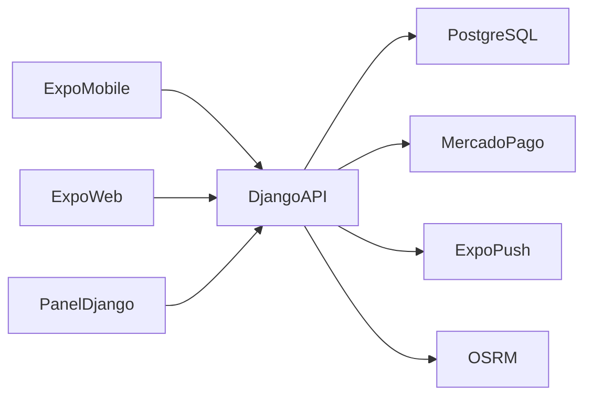

# Arquitectura

ZinApp agrupa el cliente Expo y una API Django. El backend también sirve el
panel de operaciones, la landing y el build web de Expo en `/app/`.

## Componentes

- `backend/accounts`: identidad, JWT, perfiles y verificación de repartidores.
- `backend/restaurants`: catálogo, menú, favoritos y promociones.
- `backend/orders`: pedidos, envíos, pagos, cupones, chat y disputas.
- `backend/local_services`: servicios locales independientes del catálogo.
- `backend/dashboard`: panel de administración basado en plantillas Django.
- `mobile/src`: navegación y pantallas separadas por rol (cliente, restaurante,
  repartidor y administrador).
- `GET /api/schema/` y `GET /api/docs/`: contrato OpenAPI/Swagger generado
  desde Django REST Framework para revisión técnica cuando
  `API_DOCS_ENABLED=True`.

## Límites de confianza

- Los endpoints públicos de catálogo solo devuelven campos publicables. Datos
  bancarios y del propietario se entregan por rutas autenticadas del panel.
- Los documentos de identidad de repartidores están bajo `driver_documents/`
  y requieren un administrador cuando el backend sirve media.
- El webhook de Mercado Pago valida la firma y vuelve a consultar el pago antes
  de marcar un pedido como pagado.
- Los cambios sensibles quedan registrados en `accounts.AuditLog` sin almacenar
  tokens ni payloads completos de proveedores.
- Los JWT se guardan con SecureStore en dispositivos y por sesión en web. Una
  migración a cookies HttpOnly requerirá coordinación entre API y clientes.
