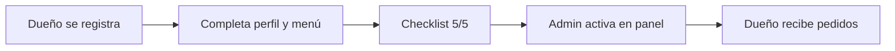

# Alta de tiendas reales — ZinApp

Guía operativa para registrar restaurantes y locales en producción.

## URLs

| Recurso | URL |
|---------|-----|
| App (clientes y dueños) | https://zinapp.com.mx/app/ |
| Panel admin | https://zinapp.com.mx/panel/ |
| API | https://zinapp.com.mx/api |

## Flujo completo



### 1. Registro del dueño

1. Abrir la app → **Regístrate**.
2. Elegir rol **Restaurante**.
3. Indicar nombre del negocio, dirección y teléfono.

El local queda **inactivo** (`is_active=false`) hasta revisión del admin. No aparece en la lista de clientes.

### 2. Configuración en la app (dueño)

En las pestañas **Menú** y **Mi perfil**, completar la checklist:

| Paso | Dónde | Qué hacer |
|------|-------|-----------|
| Menú | Menú | Al menos 1 platillo disponible |
| Logo | Mi perfil | Subir foto del local |
| CLABE | Mi perfil | 18 dígitos para transferencias |
| Horario | Mi perfil | Hora de apertura y cierre |
| Ubicación | Mi perfil | Dirección correcta (se geocodifica al guardar) |

La app muestra un banner con el progreso hasta que el local esté listo.

### 3. Revisión en panel admin (tú, como operador)

1. Entra a **https://zinapp.com.mx/panel/** con tu cuenta admin.
2. En **Resumen** verás los locales pendientes de activar (badge en Restaurantes).
3. Ve a **Restaurantes** → **Ver** el detalle del negocio.
4. Revisa la checklist (menú, logo, CLABE, horario, ubicación).
5. Si está completa → **Activar en la app**.
6. Opcional: **Pausar pedidos** si el local cierra temporalmente.

> El dueño **no** activa su propio negocio; solo completa datos en la app y espera tu activación.

### 4. Operación diaria

- **Dueño:** pausa pedidos desde Mi perfil si cierra temporalmente.
- **Admin:** puede desactivar un local o pausar pedidos desde el panel.
- **Clientes:** solo ven locales activos con al menos un producto disponible.

## Variables de entorno (producción)

Cuando dejen de usar datos demo:

```env
DEMO_ACCOUNTS_ENABLED=false
SEED_DATA=false
```

## Medios (logos y fotos)

Las imágenes se guardan en `/app/media/`. En Railway, configurar un **volume persistente** en esa ruta o migrar a S3; sin volumen, un redeploy puede borrar archivos subidos.

## Checklist antes del primer local real

- [ ] Cuenta admin del panel creada
- [ ] Volume o almacenamiento de media configurado
- [ ] `DEMO_ACCOUNTS_ENABLED=false` cuando ya no necesiten demo
- [ ] Probar registro → checklist → activación → pedido de prueba end-to-end

## Soporte al dueño

Mensaje sugerido al registrar una tienda:

> Regístrate en la app como Restaurante, completa tu menú y perfil (logo, CLABE, horario y dirección). Cuando veas «Esperando activación», avísanos y publicamos tu local en la app.

Contacto soporte: `<SUPPORT_EMAIL_CONFIGURADO>`
